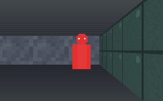
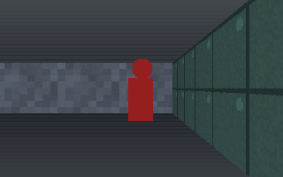

# MeatRayCast

[](LICENSE)

A raycasting game engine for [LÖVE](https://love2d.org). DDA wall renderer,
directional sprite billboards, entity-component simulation, grid collision,
fixed-timestep loop, and levels from either a procedural generator or
hand-authored text maps.

**No assets. No dependencies.** Every texture and sprite is generated at runtime,
so a fresh clone runs with nothing missing.

| facing you | facing away |
|---|---|
|  |  |

Same entity, same sheet, different angle bucket. The placeholder sprites are drawn
so that a facing bug is *visible* — two eyes toward the viewer, one in profile,
none from behind — because an enemy charging you while showing its back is a bug
you want to see immediately rather than ship.

## Quickstart

```
love .                  # procedural world
love . --map arena      # the hand-authored map in maps/arena.map
love . --selftest       # deterministic gate; prints PASS and exits 0
```

`WASD` move · mouse or `Q`/`E` turn · `F` open a door · click to fire ·
`TAB` switch procedural/authored · `R` reseed · `T` cycle theme · `F1` help

The cursor is captured for mouselook. `Escape` releases it, clicking recaptures,
and a second `Escape` quits — so getting your pointer back never costs you the
session.

```
love . --host                   listen server: play and host at once
love . --server --port 6789     headless dedicated server, no window, no GPU
love . --connect 10.0.0.5:6789  join a server
love . --browse                 list servers on the LAN and exit
love . --netcheck               is UDP usable on this machine at all?
```

Tests: `luajit tests/run_all.lua` — 2289 assertions, no LÖVE required.
Network acceptance: `powershell -File scripts/nettest.ps1` — a dedicated server
and two clients as separate processes, asserting over real UDP.

## Two ways to use it

**As a library, where you own the loop:**

```lua
local MeatRay = require('meatray')

local world = MeatRay.worldgen.generate{ width = 48, height = 48, seed = 7 }
MeatRay.raycaster.init{ theme = 'dungeon' }
MeatRay.sprites.define('imp', { angles = 8, frames = 4, fps = 8 })

function love.draw()
    local view = MeatRay.raycaster.view(px, py, angle)
    local zbuf = MeatRay.raycaster.render(view, world)
    MeatRay.sprites.draw(entities, zbuf, view)
end
```

**Or hand the loop over** — `meatray.engine` wires up the common case. It may only
call the public API, so anything it can do you can do yourself, and dropping down
to the library is never a rewrite.

The demo in `main.lua` is written against the library path deliberately, as proof
that path is sufficient on its own.

## Design

**Entities compose, they do not inherit.** An archetype names a kind and attaches
components; behaviour is whatever components an entity carries. So a flying
undead imp is two more components, not a new branch in a class hierarchy.

```lua
local Imp = MeatRay.archetype('imp', function(e)
    e:add(Billboard{ sheet = 'imp' })
    e:add(Health{ hp = 30, max = 30 })
    e.radius = 0.28
end)
```

**Components declare what replicates.** Each component type lists its own
`netFields`, and snapshots are derived from that list. Adding synced state is one
edit, and there is no hand-written serialiser per type to forget to update. The
same mechanism carries networking today and will carry save files.

**The dev picks the topology, in one line.** The engine does not choose, because a
co-op crawler, a LAN shooter and a persistent server want different answers:

```lua
MeatRay.net.host{ mode = 'listen', discovery = 'lan' }       -- play and serve
MeatRay.net.host{ mode = 'dedicated', port = 6789 }          -- headless
MeatRay.net.join('203.0.113.5:6789')                         -- or a browser entry
```

Mode, transport and discovery are three independent choices and none of them leaks
into gameplay code. A game that says nothing about networking is in `single` mode
and runs exactly as it did before. See
[`docs/NETWORKING.md`](docs/NETWORKING.md).

**The simulation never touches `love.graphics`.** Everything under `meatray/sim/`
is pure Lua, enforced by a test that loads each module with no `love` global and
scans the sources. That is what makes a headless dedicated server a configuration
choice rather than a rewrite, and it is why the simulation can be unit-tested
without a graphics stub standing in for a window — a suite that mocks the renderer
and never enters a draw path reports green while the untested half rots.

**Fixed 60 Hz simulation, interpolated rendering.** Networking requires it, and it
structurally prevents the per-frame-versus-per-tick class of bug.

**Procedural and hand-authored are equals.** Both produce the same `World`, so
nothing downstream knows which was used. Maps are readable text — a level diffs in
git and can be edited without the tool:

```
name  Test Arena
theme facility
spawn 3.5 9.5 0
entity i imp
---
##########
#........#
#..222D..#
#....i...#
##########
```

## What this is not, yet

Honest scope. These are phases in [`docs/ROADMAP.md`](docs/ROADMAP.md), not
oversights:

- **Assets are optional, and that is the point.** PNG sheets and WAV audio import,
  with positional playback. Every lookup that misses falls back to a generated
  placeholder rather than erroring, so a project with no assets runs and one with
  half its assets shows which half. The repo itself still ships no media.
- **The editor exists but is partial.** `love . --editor [map]` opens a docked
  workspace with the map editor and asset browser; the code browser and sprite
  painter are still ahead — see [`docs/EDITOR.md`](docs/EDITOR.md). There is also
  no server *browser* yet: LAN discovery works and `love . --browse` prints the
  list, but drawing it in the shell is still to come.
- **Networking works, with three named gaps.** Listen and dedicated hosting, real
  UDP over `lua-enet`, host-authoritative snapshots, local-player prediction, LAN
  discovery, passwords, kick and ban are all implemented and tested. **Not
  implemented:** master-server discovery, UDP hole punching, and the Steam
  transport. Those are designed for rather than stubbed — a transport or a
  discovery backend can be added without touching gameplay code or the browser, and
  `docs/NETWORKING.md` says exactly where each one plugs in. There is also no auth
  service: the engine calls `onAuthenticate` and the game decides.
- **No save system**, no lighting, no destruction, no weapon/inventory/ability
  systems. The roadmap orders them by dependency.

## Layout

```
meatray/sim/      headless: entities, world, collision, tick, billboard maths,
                  worldgen, map format          <- no love, unit-tested
meatray/net/      headless: wire format, transports (loopback + enet), replication,
                  host and client sessions, discovery, access control, diagnostics
meatray/render/   raycaster, sprites, textures, themes
meatray/ui/       immediate-mode widgets with a real clip stack; rect.lua is
                  love-free so the clip/dock/hit maths is unit-tested
meatray/init.lua  public API (render modules load lazily so headless still works;
                  so does meatray.net, which needs no love at all)
tests/            2289 assertions under plain LuaJIT
selftest.lua      graphics-context gate: renders, reads pixels back, writes
                  reference images
nettest.lua       headless networked client that asserts across the wire
netcheck.lua      `--netcheck`: can this machine do UDP at all
browse.lua        `--browse`: LAN server list, printed
scripts/          nettest.ps1, the multi-process network acceptance runner
maps/arena.map    hand-authored sample
```

## License

Licensed under the **[Apache License 2.0](LICENSE)** — free to use, modify, fork
and build on, commercially or not.

**Credit is required.** Apache-2.0 §4(c)–(d) obliges you to keep the copyright
notice and to reproduce [`NOTICE`](NOTICE) in anything you distribute, including
binaries and hosted builds. Credit it as `MeatRayCast by MysteryMeat`
(https://github.com/MidwestMysteryMeat/MeatRayCast) in your credits screen, About
box, or docs.

The DDA wall loop additionally carries **BSD-2-Clause** from its upstream — it is
derived from `raycaster_textured.cpp` by Lode Vandevenne, published with the
[raycasting tutorial](https://lodev.org/cgtutor/raycasting.html) and licensed
BSD-2-Clause by its author. Its notice is reproduced in [`NOTICE`](NOTICE) and the
loop carries an attribution comment. Both licences are permissive and compatible;
ship `NOTICE` alongside `LICENSE` and both attribution requirements are met.
