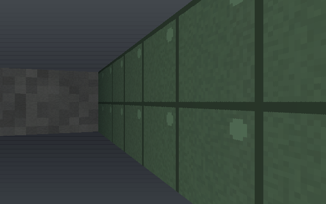
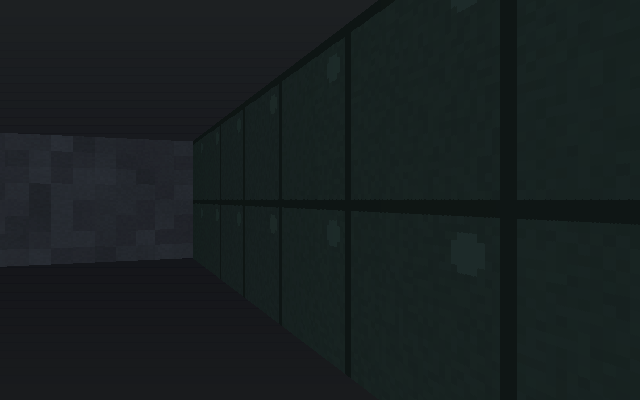
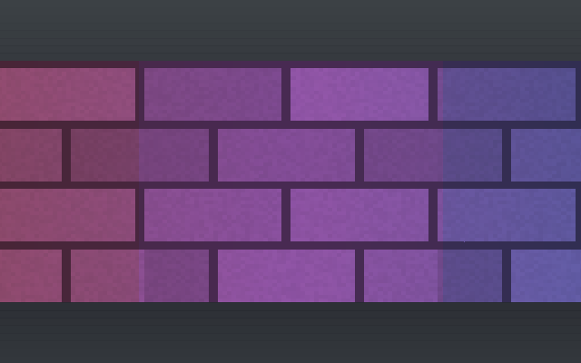
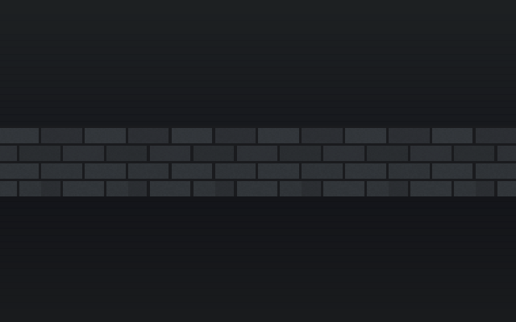
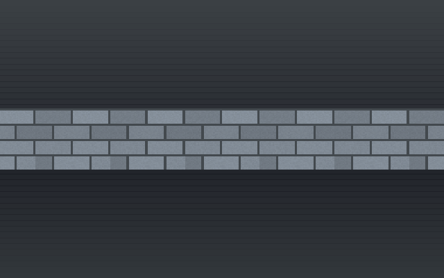
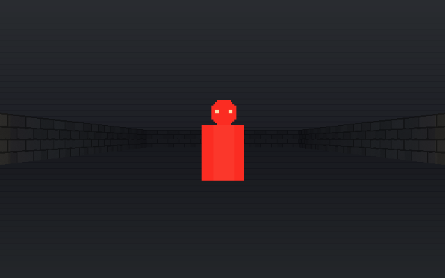
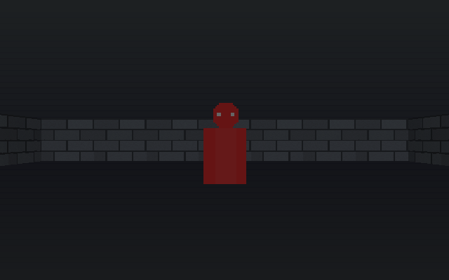

# MeatRayCast

[](https://github.com/MidwestMysteryMeat/MeatRayCast/actions/workflows/ci.yml)
[](LICENSE)

A raycasting game engine for [LÖVE](https://love2d.org). DDA wall renderer with
textured floor and ceiling casting, directional sprite billboards,
entity-component simulation, grid collision, fixed-timestep loop, and levels from
either a procedural generator or hand-authored text maps.

The AI side goes past monster state machines: **flow-field crowds** (dozens of
agents flocking through real doors on one flood fill), **neural-net agents**
(an in-tree MLP with backprop *and* neuroevolution — `scripts/evolve.lua`
breeds brains that navigate levels through raycast whiskers, **imitation
learning** trains one from your own recorded demos, and an ML-Agents-style
**RL environment server** lets PyTorch train against the live sim over stdio
— all playing through the same input path a keyboard does), and an **MCP
server** that lets an AI agent like Claude author projects, lint and write
maps, validate graphs and synthesize sounds from outside the process. See
`docs/AI.md`.

**No assets. No dependencies.** Every texture and sprite is generated at runtime,
so a fresh clone runs with nothing missing.

| facing you | facing away |
|---|---|
|  |  |

Same entity, same sheet, different angle bucket. The placeholder sprites are drawn
so that a facing bug is *visible* — two eyes toward the viewer, one in profile,
none from behind — because an enemy charging you while showing its back is a bug
you want to see immediately rather than ship.

| torch lit | torch out |
|---|---|
|  |  |

The same frame of the same map with a carried light and without one. Dropping the
torch is meant to cost you something — and to leave a level you can still walk
through, which is what `Lighting.MIN_VISIBILITY` is for.

| a coloured source tints the wall | light stops at the wall / the same light told not to |
|---|---|
|  |   |

| a sprite under a light | the same sprite in the dark |
|---|---|
|  |  |

Sprites take the light where they stand, on the same curve and with the same floor
the wall loop uses, so an entity sits *in* the scene rather than on it.

| an explosion lights the room | and leaves fire behind |
|---|---|
|  |  |

The blast is resolved by `meatray/game/explosion.lua`, which has never heard of
the renderer: it *describes* its flash and hands it out, and whoever holds a light
grid pushes it. A dedicated server runs the identical explosion and pushes
nothing. The fire is a gas field — one scalar diffusing across open tiles — with
one dynamic light per burning tile.

## Quickstart

```
love .                  # procedural world
love . --map arena      # the hand-authored map in maps/arena.map
love . --map platforms  # raised floors, ramp, short rail
love . --map crouch     # low-ceiling corridor (camera crouches)
love . --map tower      # multi-map storeys (F on stairs → other map)
love . --map stacked    # in-world layers (F on stairs → storey 2)
love . --meatgraph      # MeatGraphRay (MeatEngine MeatGraph kinship)
love . --meatgraph meatgraphs/triggers.graph.json --map arena
love . --selftest       # deterministic gate; prints PASS and exits 0
```

**Making your own game?** A game is a *project* — a folder the engine points
at, created from the title menu (Projects) or scripted. Play it, edit it, ship
it as its own exe:

```
love . --project projects/mygame              # play it
love . --editor --project projects/mygame     # edit it (saves land in the project)
powershell -File scripts/package.ps1 -Project projects/mygame   # ship it
```

`docs/GETTING_STARTED.md` is the blank-folder-to-exe walkthrough;
`scripts/walkthrough.lua` executes the same loop mechanically; and
`examples/hunted/` is a complete tracked example — three text files whose
`game.lua` defines an entity kind the engine has never heard of.

`WASD` move · mouse or `Q`/`E` turn · `F` open a door · click to fire ·
`1`/`2` pistol or grenade launcher · `TAB` switch procedural/authored ·
`R` reseed · `T` cycle theme · `L` torch · `F1` help

The cursor is captured for mouselook. `Escape` releases it, clicking recaptures,
and a second `Escape` quits — so getting your pointer back never costs you the
session.

```
love . --host                   listen server: play and host at once
love . --server --port 6789     headless dedicated server, no window, no GPU
love . --connect 10.0.0.5:6789  join a server
love . --registry URL           announce to / join through a registry (repeatable)
love . --browse                 list servers on the LAN and exit
love . --netcheck               is UDP usable on this machine at all?
love . --netfrag --connect A    measure the snapshot stream on a real socket
love . --netproxy --port P      a UDP relay that drops a fraction of the traffic
love . --punchcheck --connect A --registry URL
                                join through a registry, report what the punch did
love . --bench [--bench-flat]   renderer benchmark, fixed camera; --bench-flat
                                turns floor casting off so both paths can be
                                measured out of one build
```

Tests: `powershell -File scripts/suite.ps1` — the full suite under **both** LuaJIT
and plain Lua 5.4, no LÖVE required (`luajit tests/run_all.lua` runs one lane).
Extra gates: `luajit scripts/maplint.lua maps/*.map` (map validation),
`luajit scripts/fuzz.lua` (parser fuzzing), `luajit scripts/bench_headless.lua`
(hot-path budgets).
Network acceptance: `powershell -File scripts/nettest.ps1` — a dedicated server
and two clients as separate processes, asserting over real UDP.
Relay acceptance: `powershell -File scripts/relaycheck.ps1` — the relay in one
process, a dedicated host and a client in another, playing through it.
Snapshot stream: `powershell -File scripts/netfrag.ps1` — a server, a relay that
destroys a fifth of the datagrams, and a probe that counts what survives. It is
how the claim "the snapshot stream is unreliable" stopped being a claim.

## Building a release

```
powershell -File scripts/package.ps1
```

Stages the game and the engine — stripping the editor, the tests, the docs and
the dev scripts — into a `.love`, fuses it onto `love.exe`, and drops the LÖVE
runtime DLLs beside it under `build/MeatRayCast-<version>/`. The version comes
from `git describe`, and the script boots the fused build for five seconds and
fails if it does not reach the title screen — so "a stranger double-clicks the
exe and plays" is checked by the build, not hoped for. `-Love <dir>` points at a
LÖVE install; `-NoSmoke` skips the boot check.

`-Project <dir>` builds a *game project* instead of the demo: the project is
staged into the fuse (where the runtime auto-mounts it), its assets are kept,
and the exe takes its name and version from the project's `project.json`. The
Map panel's **Export game** button runs the same script from inside the editor.

## Two ways to use it

**As a library, where you own the loop:**

```lua
local MeatRay = require('meatray')

local world = MeatRay.worldgen.generate{ width = 48, height = 48, seed = 7 }
MeatRay.raycaster.init{ theme = 'dungeon' }
MeatRay.sprites.define('imp', { angles = 8, frames = 4, fps = 8 })

function love.draw()
    local view = MeatRay.raycaster.view(px, py, angle)
    local zbuf = MeatRay.raycaster.render(view, world)
    MeatRay.sprites.draw(entities, zbuf, view)
end
```

**Or hand the loop over** — `meatray.engine` wires up the common case. It may only
call the public API, so anything it can do you can do yourself, and dropping down
to the library is never a rewrite.

The demo in `main.lua` is written against the library path deliberately, as proof
that path is sufficient on its own.

Full reference: [`docs/API.md`](docs/API.md).

## Design

**Entities compose, they do not inherit.** An archetype names a kind and attaches
components; behaviour is whatever components an entity carries. So a flying
undead imp is two more components, not a new branch in a class hierarchy.

```lua
local Imp = MeatRay.archetype('imp', function(e)
    e:add(Billboard{ sheet = 'imp' })
    e:add(Health{ hp = 30, max = 30 })
    e.radius = 0.28
end)
```

**Components declare what replicates.** Each component type lists its own
`netFields`, and snapshots are derived from that list. Adding synced state is one
edit, and there is no hand-written serialiser per type to forget to update. The
same mechanism carries networking today and will carry save files. It also
decides what a snapshot may leave out: most frames carry only the entities and
the declared fields that changed since the last keyframe, which is an 89% cut in
snapshot bytes on an idle scene and still 55% with everything moving.

**The dev picks the topology, in one line.** The engine does not choose, because a
co-op crawler, a LAN shooter and a persistent server want different answers:

```lua
MeatRay.net.host{ mode = 'listen', discovery = 'lan' }       -- play and serve
MeatRay.net.host{ mode = 'dedicated', port = 6789 }          -- headless
MeatRay.net.join('203.0.113.5:6789')                         -- or a browser entry
```

Mode, transport and discovery are three independent choices and none of them leaks
into gameplay code. A game that says nothing about networking is in `single` mode
and runs exactly as it did before. See
[`docs/NETWORKING.md`](docs/NETWORKING.md).

**The simulation never touches `love.graphics`.** Everything under `meatray/sim/`
is pure Lua, enforced by a test that loads each module with no `love` global and
scans the sources. That is what makes a headless dedicated server a configuration
choice rather than a rewrite, and it is why the simulation can be unit-tested
without a graphics stub standing in for a window — a suite that mocks the renderer
and never enters a draw path reports green while the untested half rots.

**Fixed 60 Hz simulation, interpolated rendering.** Networking requires it, and it
structurally prevents the per-frame-versus-per-tick class of bug.

**Procedural and hand-authored are equals.** Both produce the same `World`, so
nothing downstream knows which was used. Maps are readable text — a level diffs in
git and can be edited without the tool:

```
name  Test Arena
theme facility
spawn 3.5 9.5 0
entity i imp
---
##########
#........#
#..222D..#
#....i...#
##########
```

## What this is not, yet

Honest scope. These are phases in [`docs/ROADMAP.md`](docs/ROADMAP.md), not
oversights:

- **Assets are optional, and that is the point.** PNG sheets and WAV audio import,
  with positional playback. Every lookup that misses falls back to a generated
  placeholder rather than erroring, so a project with no assets runs and one with
  half its assets shows which half. The repo itself still ships no media.
- **The editor is built.** `love . --editor [map]` opens a docked workspace with
  four panels — map editor with a live first-person preview, asset browser, code
  browser with hot reload, and sprite painter — see
  [`docs/EDITOR.md`](docs/EDITOR.md). Still missing: a server *browser*. LAN
  discovery works and `love . --browse` prints the list, but drawing it in the
  shell is still to come.
- **Networking works, with one named gap.** Listen and dedicated hosting, real
  UDP over `lua-enet`, host-authoritative dirty-flag snapshots against one shared
  baseline (no per-peer state, no acks), local-player prediction, LAN
  discovery, master-server discovery with a registry you host yourself, UDP hole
  punching, a relay for the hosts a punch cannot reach, a Steam transport over
  the Steam Datagram Relay, passwords, kick and ban are all implemented and
  tested. **Not implemented:** Steam *lobby* discovery — the transport dials an
  account you already know, a lobby is how you find one. That is designed for
  rather than stubbed: a discovery backend can be added without touching gameplay
  code or the browser, and `docs/NETWORKING.md` says exactly where it plugs in.
  There is also no auth service: the engine calls `onAuthenticate` and the game
  decides.
- **The Steam transport needs two things this repository will never ship.** A
  `luasteam` build (MIT) and Valve's `steam_api64.dll`, whose licence is not
  Apache-2.0 compatible under any reading. When either is missing, or the Steam
  client is not running, asking for `transport = 'steam'` returns a sentence
  saying which and `direct`, `lan`, `enet` and `relay` are untouched — a service
  being absent must never be the reason a game cannot be played, and that path is
  asserted on a machine with no Steam on it. Building the binding is documented,
  including why the prebuilt one fails with an error that points nowhere near the
  cause. Two accounts meeting over the relay is **untested**: development had one
  Steam account on one machine, which proved `ConnectP2P`, the relay network
  coming up with 25 usable relays, and a full host/client session over it, and
  cannot prove the rest.
- **Hole punching is implemented and its success rate is not claimed.** The
  registry introduces both peers and each punches from its own game socket; that
  the packets leave the right socket was watched happening, and NAT traversal
  itself cannot be tested on one machine and is not asserted anywhere. Measured
  real-world success for direct connections is 55–80%, not the 90% usually
  quoted — which is why the relay behind it is not an optional extra.
- **The relay is built; running one is a decision, not a build.** `love
  relayserver` forwards a session between peers that cannot reach each other, and
  it is a forwarder rather than a service — client, relay and host all run
  happily on one machine over loopback, which is how it is tested. Deploying one
  needs a box with a public address and costs bandwidth: about 30 kB/s of relay
  egress per player at the engine's own ceilings, capped by default at 256 KiB/s
  per session and 1 MiB/s in total, which is 2.6 TB a month at saturation. Both
  numbers are configurable and both are printed at startup. A relay being down
  can never stop a game: `direct` and `lan` do not know it exists.
  **ENet has no encryption, so whoever runs a relay can read and alter every
  session passing through it.** A ticket is permission to occupy a slot, not an
  identity, and the relay authenticates who may *use* a session rather than
  protecting what travels inside one. Run your own, or route through an operator
  you would trust with the traffic. Fixing this properly means an end-to-end
  encrypted transport, which this is not.
- **Lighting is off by default.** Per-tile coloured light with falloff, baked
  static sources and per-frame dynamic ones, is implemented in
  `meatray/render/lighting.lua` — but a renderer with no light grid attached
  behaves exactly as it did without one. Attaching it is a call, not a migration:

      local Lighting = require('meatray.render.lighting')
      local lights = Lighting.new{ world = world, baseLevel = 0.34 }
      lights:addStatic{ x = 8.5, y = 3.5, radius = 6, color = { 1, 0.6, 0.24 } }
      MeatRay.raycaster.setLighting(lights)

      -- per frame
      lights:beginFrame()
      lights:addDynamic{ x = px, y = py, radius = 6.5, color = { 1, .86, .62 } }

  Sampling costs `O(samples × dynamic lights)` and nothing per world tile: static
  light is baked once, `lights:invalidateTile(tx, ty)` relights only the
  footprints of the sources that could see the change, and an unchanged world
  does no work. `Lighting.MIN_VISIBILITY` is the floor below which nothing
  renders, so an unlit room is dark rather than unreadable.
- **Weapons, inventory, explosions and gas** (`meatray/game/`), built on the
  ability system rather than beside it, and headless like the rest of it:

  ```lua
  Weapons.define('pistol', { damage = 12, magazine = 12, fireInterval = 0.15 })
  Weapons.equip(player, 'pistol')
  Weapons.fire(player, { world = world, entities = entities })   -- on the host
  ```

  Three things worth knowing before you use any of it:

  **A weapon does not subtract hit points**; it applies a damage *effect*. That is
  what makes armour, resistances, immunities and damage-over-time compose with a
  rifle round, an explosion and a burning floor tile without any of the four
  knowing about the others.

  **The fire rate is enforced in ticks, not in inputs.** `Weapons.fire` reads the
  cooldown and refuses; only `Weapons.tick` — one call per fixed simulation step —
  moves it. A client that sends fire requests faster than the tick rate does not
  fire faster than the tick rate, and there is no configuration in which that is
  untrue, because there is no other writer.

  **The gas field costs what its activity costs.** Cells wake on change and
  settled cells sleep, so `field:step()` on a settled field visits nothing at all,
  and the same disturbance in a 20×20 and a 40×40 world costs the same. With
  `decay = 0` it conserves mass exactly; with decay, the rate is exact and
  everything removed is booked to `field.lost`. Gas does not cross a shut door.

- **No destruction system.** The roadmap orders the rest by dependency.

## Layout

```
meatray/sim/      headless: entities, world, collision, tick, billboard maths,
                  worldgen, map format          <- no love, unit-tested
meatray/net/      headless: wire format, transports (loopback + enet), replication,
                  host and client sessions, discovery, access control, diagnostics
meatray/game/     headless: attributes, effects, tags, abilities, damage, weapons,
                  projectiles, inventory, explosions, gas   <- rules, no love
meatray/render/   raycaster, sprites, textures, themes, lighting
                  (lighting.lua is love-free and unit-tested like the sim)
meatray/ui/       immediate-mode widgets with a real clip stack; rect.lua,
                  server_row.lua and inventory_view.lua are love-free, so the
                  clip/dock/hit maths and every "what does this row say"
                  decision are unit-tested rather than trapped in a panel
meatray/init.lua  public API (render modules load lazily so headless still works;
                  so does meatray.net, which needs no love at all)
tests/            5940 assertions under plain LuaJIT
selftest.lua      graphics-context gate: renders, reads pixels back, writes
                  reference images
nettest.lua       headless networked client that asserts across the wire
netcheck.lua      `--netcheck`: can this machine do UDP at all
netfrag.lua       `--netfrag`: measures the snapshot stream on a real socket —
                  size, delivery under loss, and float32 fidelity
scripts/snapbytes.lua
                  `luajit scripts/snapbytes.lua`: what dirty-flag snapshots save,
                  re-measurable, including the everything-moving worst case
netproxy.lua      `--netproxy`: a UDP relay that drops a configurable fraction,
                  so loss happens to ENet rather than inside our transport
browse.lua        `--browse`: LAN server list, printed
punchcheck.lua    `--punchcheck`: joins through a registry and reports the hole
                  punch with numbers - whether the introduction round trip
                  happened, and that the connect did not wait for it
masterserver/     the reference registry: `love masterserver --port 8110`
                  and the relay's session logic (relay.lua, relayhost.lua),
                  split pure-logic / socket-binding exactly as the registry is
relayserver/      the reference relay: `love relayserver --port 6790`
relaycheck/       `love relaycheck` - a real host and a real client playing
                  through a real relay over real UDP, with stated budgets
bench.lua         `--bench`: fixed camera, raycaster only, reports draw calls
                  and frame time; `--bench-flat` measures the pre-floor-cast
                  path from the same build
scripts/          nettest.ps1, netfrag.ps1 and relaycheck.ps1, the
                  multi-process network runners
maps/arena.map       hand-authored sample
maps/platforms.map   raised floors / ramp demo
```

## License

Licensed under the **[Apache License 2.0](LICENSE)** — free to use, modify, fork
and build on, commercially or not.

**Credit is required.** Apache-2.0 §4(c)–(d) obliges you to keep the copyright
notice and to reproduce [`NOTICE`](NOTICE) in anything you distribute, including
binaries and hosted builds. Credit it as `MeatRayCast by MysteryMeat`
(https://github.com/MidwestMysteryMeat/MeatRayCast) in your credits screen, About
box, or docs.

The DDA wall loop and the floor/ceiling cast additionally carry **BSD-2-Clause**
from their upstream — they are derived from `raycaster_textured.cpp` and
`raycaster_floor.cpp` by Lode Vandevenne, published with the
[raycasting tutorial](https://lodev.org/cgtutor/raycasting.html) and licensed
BSD-2-Clause by their author. That notice is reproduced in [`NOTICE`](NOTICE) and
both carry an attribution comment. Both licences are permissive and compatible;
ship `NOTICE` alongside `LICENSE` and both attribution requirements are met.
