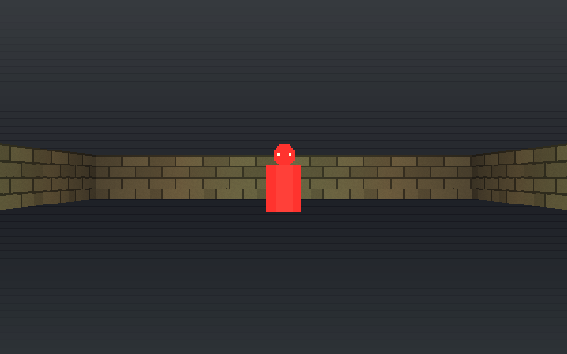
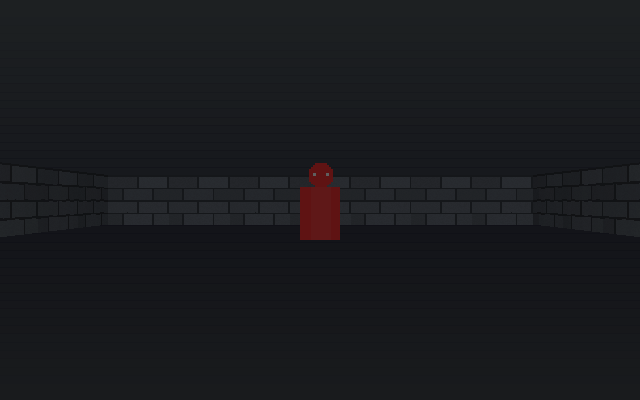
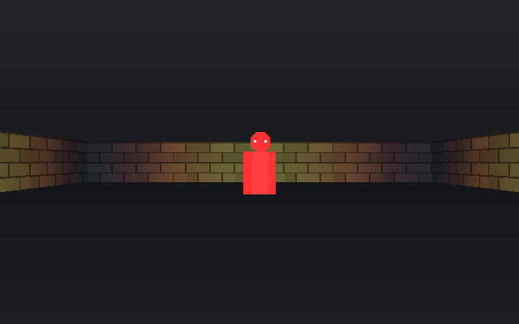
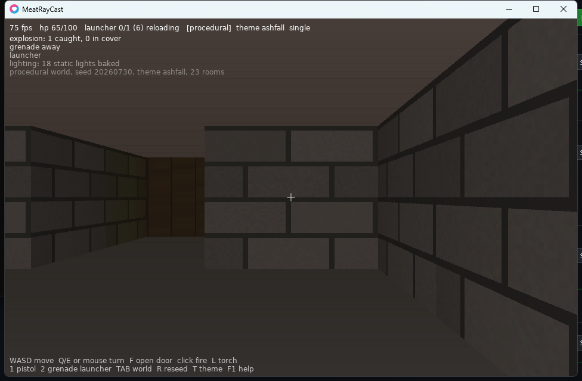

# MeatRayCast roadmap

Ordered by dependency, not by appeal. Each phase lists what it needs from the
ones before it, because several of these systems are cheap in the right order and
expensive in the wrong one.

Status legend: **done** · **next** · planned

---

## Phase 1 — Simulation core · **done**

Entities with composed components, tile world, grid collision with wall slide and
hitscan, fixed 60 Hz tick, optional BSP worldgen, hand-authored map format.
No LÖVE dependency anywhere in `meatray/sim/`. (5793 headless assertions now cover
the simulation, the net layer, the UI maths and the asset pipeline together, with
additional assertions in `love . --selftest` for the parts that need a real
context.)

The two decisions everything downstream leans on:

- **Components declare their own `netFields`.** Snapshots derive from that
  declaration, so replication, save files and network messages all read the same
  source of truth. Adding a synced field is one edit, not three.
- **The headless rule.** `meatray/sim/*` never touches `love.graphics`, enforced
  by a test. This is what keeps a dedicated server a config change and keeps the
  simulation testable without a window.

## Phase 2 — Render layer · **done**

DDA wall renderer (carried from raycaster-core, BSD attribution in `NOTICE`),
procedural texture generation, theme palettes, and sprite billboards with 1..N
angle buckets, depth sorting and per-column z-buffer occlusion. Plus a demo that
proves it: two sprite kinds, a door, wall-slide movement, a hitscan weapon.

The four modules raycaster-core hard-required (`themes`, `doors`, `corruption`,
`atmosphere`) become injected or optional here — that coupling is the main thing
being fixed in the port, not just moved.

## Phase 3 — GUI toolkit + editor shell · **done**

`love . --editor` opens **one workspace** with dockable, tabbed panels: map
editor, code browser, asset browser, sprite painter, inspector and console. Full
design in [`EDITOR.md`](EDITOR.md).

**Build the GUI toolkit first and separately.** Four panels need it, and a toolkit
extracted after the first one is written ends up shaped by that caller and fits
the rest badly. Immediate-mode suits a raycaster: panels, docking, tabs, buttons,
sliders, scroll regions, text fields, a palette strip, and a nested clip stack —
`love.graphics.setScissor` has no stack, which is a real gap worth wrapping once.

The map editor panel authors tiles, doors, spawn, entity markers and theme —
exactly what the engine understands and nothing it doesn't — with a live
first-person preview beside the paint grid.

The **code browser** browses and views the project (including the engine's own
source), quick-edits with hot reload on save, and hands off to an external editor
for real work. Hot reload covers **data and definitions** — archetypes, sprite
defs, themes, maps, tuning tables — while live entities keep their state. Full
module reload with state migration is deliberately refused: it leaves closures
holding old upvalues and breaks metatable identity, producing bugs that exist only
after a reload and cannot be reproduced from a clean boot.

The **asset browser** browses, previews and imports: step a sheet through its
angle buckets, audition a sound, open a map. It is the front end for phase 4.

The whole editor must be strippable from a release build — one entry point a
shipped `main.lua` never calls.

## Phase 4 — Asset import + registry · **done**

The engine generates every texture and needs no files. That is still the default;
importing layers on top of it rather than replacing it.

- **Images** (`meatray/asset/image.lua`): PNG sprite sheets and wall textures,
  sliced by a declared grid and registered under the name the `Billboard`
  component already refers to. A sheet whose dimensions do not divide evenly by
  its declared angle and frame counts is **refused with the remainder in the
  message**, not imported — that misconfiguration otherwise renders as sprites
  sliced half-off and reads as a renderer bug for as long as it takes to work out
  it is not one.
- **Audio** (`meatray/asset/sound.lua`): WAV import, since LÖVE decodes WAV
  natively and importing one therefore adds no dependency. Positional playback
  attenuates by distance and pans by the bearing between the listener's facing and
  the source, using the renderer's own definition of "right" so audio and video
  never disagree about which side something is on. Missing audio is silent, never
  an error. `conf.lua` now enables `love.audio`/`love.sound` for any run with a
  window and leaves them off for `--server`, `--nettest`, `--browse` and
  `--netcheck`: a dedicated server has no business opening an audio device.
- **An asset registry with procedural fallback** (`meatray/asset/registry.lua`):
  every lookup that misses falls back to a generated placeholder rather than
  erroring. There is exactly one load site and it is guarded, including against a
  loader that raises and against a placeholder producer that is itself broken.

The registry keeps four states, and the difference between the last two is the
point: `pending`, `file`, `generated` (no source path was ever given — procedural
by design, and fine) and `fallback` (a source path was given and did not load —
**missing**). `Asset.missing()` and `Asset.report()` answer "which half", and
resolve anything still pending first, because an asset whose absence is only
discovered on the frame that needs it is an asset discovered in front of a player.

Everything with an interesting failure mode is headless: grid arithmetic, name
resolution, resolution policy, and the falloff and pan curves are all asserted
under plain LuaJIT with no LÖVE (`tests/test_asset_*.lua`). The two modules that
genuinely need a decoder or an audio device are thin and covered by
`love . --selftest`, which encodes a PNG and writes a WAV at runtime rather than
shipping fixtures — the repository holds no media by policy.

The asset browser panel (`meatray/ui/panel_assets.lua`) is the front end: a
thumbnail grid by category, a preview that steps a sheet through its angle buckets
while animating it, auditions a sound with the distance and pan it would play at,
and shows a map's dimensions — and missing assets drawn distinctly rather than
omitted, since that is the single most useful thing the panel can tell you.

Two lessons already paid for elsewhere and applied here: keep media out of the
repo (`.gitignore` blocks it by default), and make missing files a *documented
fallback* rather than a crash — a guarded load site is the difference between a
fresh clone that runs and one that dies on launch.

## Phase 5 — Save system · **done**

World state, entity state and arbitrary game progress written to a versioned
file, and loaded back. It was mostly already designed, and the design held: a
save *is* a snapshot written to a file, so `meatray/save/` contains no serialiser
and no field list of its own. A world becomes the payload the replication layer
already builds for a joining client; an entity becomes the snapshot its
components already declare through `netFields`. Adding a synced field still means
one edit, and it now persists as well as replicates.

- **`meatray/save/format.lua`** — the envelope. A header line
  (`MEATRAYSAVE <metaBytes> <bodyBytes> <adler32>`) followed by a metadata
  section and a body section, both encoded with `meatray/net/serialize.lua`.
  Three properties fall out of that shape and each is a requirement: metadata
  reads without the body, truncation is arithmetic rather than guesswork, and a
  flipped byte that would still decode is caught by the checksum instead of
  loading as a lie. (Integrity, not security — saves are not a trust boundary;
  the network is.)
- **`meatray/save/storage.lua`** — three backends behind one interface: LÖVE's
  sandboxed filesystem, plain `io`/`os` for a dedicated server, and an in-memory
  one whose only purpose is to make the failures injectable.
- **`meatray/save/state.lua`** — capture and restore. Restore builds a new world
  and a new set of entities and hands them over only if all of it worked, so a
  save that turns out to be broken costs the load rather than the session.
- **`meatray/save/init.lua`** — slots, listing, metadata, delete.

**The version field exists from v1, and so does the migration path.** A format
with no version is a format that can never change, because the first change makes
every existing file indistinguishable from a corrupt one. The version lives in
exactly one place (inside the metadata section, so two copies can never
disagree), a save from a newer build is refused by name, and a save with no
version is refused rather than assumed to be v1 — that assumption is how a
version field becomes decorative on the day it starts to matter. There are no
migrations to ship yet, since v1 is the first version there has ever been, but
the mechanism is exercised: `tests/test_save_format.lua` writes a v0 file,
registers a v0 → v1 migration, and loads through it — along with a migration that
does not raise the version, one that raises, one that refuses and one that
returns nonsense, none of which may hang or escape the loader.

**Atomic writes, honestly described.** LÖVE's filesystem is PhysFS, and PhysFS
has no rename and no move: what a shipped game gets is `write`, `append`, `read`,
`remove`, `getInfo`, `createDirectory`, `getDirectoryItems` and file handles.
There is no atomic swap to call, so claiming one would be a lie. What the save
path does instead is write a temporary file, verify it by reading it back, write
the target, verify that, and remove the temporary file — with recovery from the
temporary file built into *reading*, not into a repair tool somebody has to be
told to run. The guarantee that buys is exact: **at every instant there is a
complete, valid save on disk**, the old one or the new one, and an interrupted
save is always detectable and always recoverable. The `io` backend does have
`os.rename` and uses it (genuinely atomic on POSIX; on Windows the destination
must be removed first, so the same recovery path still carries it).

**Listing does not open saves.** A browser showing ten slots reads the first
kilobyte of each file and stops, which is only possible because the metadata sits
in its own length-declared section ahead of the body. A slot that cannot be read
is still listed, carrying the reason — omitting it would hide a file that is
still occupying the slot the player is trying to use.

**What a load refuses to invent**, inherited deliberately from replication: an
archetype this build does not know becomes a positional ghost and is reported in
`state.unknown`, and component state with no component to receive it is reported
in `state.dropped`. Both are returned rather than printed, so they can be asserted
and so the caller decides whether a ghost is a broken save or a mod unloaded on
purpose.

359 headless assertions cover it (`tests/test_save_format.lua`,
`test_save_state.lua`, `test_save_slots.lua`), including every prefix of a valid
save, every single-byte corruption of its last two hundred bytes, and a real
save-and-load cycle through actual files in a temporary directory. 36 more in
`love . --selftest` do the whole cycle against `love.filesystem` itself, because
everything else runs against a filesystem that is a Lua table and would keep
passing if the real one did not work at all.

## Phase 6 — Sprite painter · **done**

An in-engine pixel editor: canvas, palette, per-frame and per-angle-bucket
editing, export to a sheet the asset registry can import. Depends on the GUI
toolkit (phase 3) and the asset pipeline (phase 4) — building it earlier would
mean building both of those badly, inside it.

## Phase 7 — Networking · **done**

Built early, out of dependency order, and deliberately: every system built after
this point can be designed replicated from the start, which is far cheaper than
retrofitting replication onto a finished system. Phases 3 to 6 gained a constraint
by waiting — the server browser needs the phase 3 toolkit — and the gameplay phases
gained more than they lost.

Implemented: `single`/`listen`/`dedicated`/`client` modes chosen by the dev in one
line; `loopback` and `enet` transports behind one interface; host-authoritative
snapshots derived from `netFields` at 20 Hz against a 60 Hz tick, with clients
interpolating; inputs (never positions) from client to host, clamped on arrival;
world mutation replicated by diffing, so game code that toggles a door directly
still replicates; local-player movement prediction with smoothed and hard
correction, and no prediction of health or damage; LAN discovery over UDP
broadcast with measured ping; password access control, kick, ban by address, and
an `onAuthenticate` hook; master-server discovery against a registry anyone can
run, with a UDP challenge so nobody can list a stranger's address; UDP hole
punching, where the registry introduces both peers and each punches from its own
game socket; and startup diagnostics that name the port to forward and
distinguish "LAN players can join" from "nobody can reach you".

What the hole punch does and does not claim: the introduction round trip and the
punch leaving the game socket were watched happening against a running registry —
a host bound to 6789 emits a datagram whose source port is 6789, which is the
only thing that opens a usable mapping. Traversal itself cannot be tested on one
machine with no NAT and is not asserted. Nothing reports a punch as having
succeeded; a host reports only that it will try.

Both of the things this phase originally left out are now built. The relay
(phase 16's tail) and the Steam transport (phase 17) each landed as new files
with one registration line and no edit to `host.lua`, `client.lua`,
`replication.lua`, the snapshot codec or any gameplay code — which was the claim
the transport interface existed to make, tested twice now rather than asserted
once. The relay is not a rounding error: measured direct-connect success is
55–80%, not the 90% usually quoted (sources in `docs/MASTERSERVER.md`), so it is
load bearing for something like a fifth to a half of hosts. What remains unbuilt
is Steam *lobby* discovery, which is a discovery backend and not a transport.

## Phase 8 — Weapons and inventory · **done**

Four modules under `meatray/game/`, built on phase 9's ability system rather than
beside it. The one thing that matters about the layering: **a weapon does not
subtract hit points.** It applies a damage *effect*, so armour soaks it, a fire
resistance reduces it and an immunity refuses it — and none of those three appear
anywhere in `weapons.lua`. Written the other way, every new interaction is a new
special case in every existing one.

- **Damage** (`meatray/game/damage.lua`) — the one road every hit takes. It
  exists as its own module because four things need it (weapons, projectiles,
  explosions, gas) and all four are required *by* `meatray/game/init.lua`, so
  reaching back through the facade for `Game.damage` would be a require cycle.
  `Game.damage` is still the public spelling; it is this module's function.

- **Weapons** (`meatray/game/weapons.lua`) — hitscan and projectile, ammo,
  magazine and reserve, reload, fire rate, spread, recoil. It adopts the
  *existing* `weapon` component rather than declaring a second one, appending
  `id`, `reserve`, `reloadRemaining` and `shots` through
  `Attributes.declareField` — so all four replicate and save with no edit to
  `components.lua`, `replication.lua` or `save/state.lua`.

  **The fire rate is enforced in ticks, not in inputs.** `Weapons.fire` never
  advances time; it reads the cooldown and refuses. The cooldown moves in exactly
  one place, `Weapons.tick`, called once per fixed simulation step. A thousand
  fire commands inside one tick therefore produce one shot and nine hundred and
  ninety-nine refusals, and the suite asserts exactly that — because a cooldown
  decremented when a request *arrives* means a client that sends requests faster
  than the tick rate fires faster than the tick rate, which is a shipped bug in a
  sibling project and not a hypothetical.

  Spread and recoil are random and therefore deterministic: every deviation comes
  from `meatray.sim.worldgen.rng` seeded from a per-weapon seed the host owns plus
  the shot count, never `math.random`, whose sequence differs between Lua builds.
  Recoil is *reported* rather than applied — a host that wrote a kick into
  `e.angle` would have it overwritten by the next input packet, because aim is an
  input — so a shot returns its kick and the client that owns the aim applies it.

- **Projectiles** (`meatray/game/projectiles.lua`) — ordinary entities carrying a
  `projectile` component, so they replicate, save and draw through machinery that
  needed no edit. Flight is substepped: a bolt at 60 tiles/second moves a whole
  tile per tick, and a whole tile is exactly the thing it is meant to be stopped
  by, so `x = x + vx * dt` walks through walls as soon as the speed goes up. The
  suite fires the same projectile at the same wall at 5, 50, 500 and 5000
  tiles/second and asserts all four stop at it.

- **Inventory** (`meatray/game/inventory.lua`) — slots, stacks, pickup and drop as
  world entities, and equipping, which drives the weapon component and wires the
  new gun's reload to the matching ammunition item in the bag (weapons.lua never
  learns that inventories exist; it takes a supply closure).

  **Nothing vanishes**, and that is the whole design: `added + leftover` always
  equals what was asked for, on every path in and out. A pickup that half fits
  leaves the remainder *on the floor* and the world entity survives; a stack fills
  to its cap and the surplus is returned rather than deleted; a drop that fails
  to build its entity puts the items back. "The game ate my item" is a bug report
  players file, remember and repeat, and it is almost never a corrupted save.

  The replicated state is one string — `"1=pistol*1|3=ammo.9mm*60"` — for the
  reason the tag container is a string: a table in a `netFields` declaration is
  shared by reference into the snapshot, so a listen server would have its host
  and its local client mutating the same slots. The slot array is a decode of
  that string, so applying a snapshot (from the network or from a save)
  invalidates it automatically. There is no cache-invalidation call to forget,
  because the cache's version tag *is* the data.

Inventory UI still comes from the phase 3 toolkit and is not built yet; the model
underneath it is.

## Phase 9 — Abilities (GAS-style) · **done**

Modelled on Unreal's Gameplay Ability System, which is the right reference here
because it solves exactly this problem: attributes, effects, tags, and abilities
with costs and cooldowns, all replicated. Four modules under `meatray/game/`,
none of which touches LÖVE.

They live in `meatray/game/` rather than `meatray/sim/` because they are rules
rather than physics — `meatray/sim/` answers "where is everything and what did
the ray hit", and a game that replaces every attribute and ability in here still
wants all of that. The headless rule follows them across the boundary regardless:
`tests/test_headless.lua` loads each of these with no `love` global present and
scans their sources the same way it scans the simulation's, because the reason
for the rule — a dedicated server runs the whole simulation with no graphics
context — applies to gameplay more strongly than to anything else.

- **Tags** (`meatray/game/tags.lua`) — hierarchical dotted strings
  (`state.stunned`, `damage.type.fire`, `ability.dash`) with matching that
  respects the hierarchy: a query for `damage.type` finds `damage.type.fire`,
  and a fire ward written today still covers `damage.type.fire.greek` invented
  next year. The near-miss is the part that has to be tested rather than
  assumed — a prefix comparison alone makes `damage.typeX` look like a child of
  `damage.type`, and the resistance that silently soaks it produces a number
  that is slightly wrong forever. Containers count grants rather than flagging
  them, so two stuns expiring one at a time do not clear each other.

- **Attributes** (`meatray/game/attributes.lua`) — `base` (what instant effects
  change) and `cur` (base folded with active modifiers, then clamped), both
  declared `netFields`, so an attribute replicates and saves with nothing added
  to either layer. **The existing `health` component was adopted, not
  duplicated**: `health.hp` is still the live pool and `health.max` is still the
  effective maximum, so every existing reader including the HUD is unchanged.
  One field is new — `health.maxBase`, the unbuffed maximum — added through
  `Attributes.declareField` rather than by editing `components.lua`, because a
  temporary +20 max health cannot be reverted correctly by subtracting what it
  added the moment anything else moves the base underneath it.

  **The modifier order is written down and enforced**, because
  additive-then-multiplicative and multiplicative-then-additive are different
  games and "whichever `pairs()` visited first" is a bug:

  ```
  cur = clamp( override  or  ((base + SUM(add)) * PRODUCT(mul)) )
  ```

  Additive first, so a multiplier is scale-free. The fold is independent of
  iteration order by construction — the two buckets commute, and the one
  operation that does not (`override`) is resolved by explicit priority and
  application order — and it sorts before folding so floating-point association
  is fixed too.

- **Gameplay effects** (`meatray/game/effects.lua`) — instant, duration-based or
  infinite, with periods for damage over time and regeneration, stacking by
  `independent` / `refresh` / `stack` with a cap, resistances that scale
  incoming effects by tag, immunity, and cleansing by tag query. **Damage is an
  effect**, which is what makes armour a shield without the damage path knowing
  armour exists: `health` declares `soak = 'armour'`, and melee, explosions and
  the fourth tick of a poison all get that behaviour for free.

- **Abilities** (`meatray/game/abilities.lua`) — activation with cost, cooldown,
  cast time, blocking and required tags, and effects applied to the activator or
  to targets on hit. Every refusal is a value: `'cooldown'`, `'cost'` naming the
  attribute that could not pay, `'blocked by tag: state.stunned'`, `'not
  granted'`, `'already casting'`. An ability that declines silently is the bug
  that reads as "the button does nothing sometimes". Cost and cooldown commit at
  activation, effects at cast completion — charging on completion means whoever
  interrupts every cast pays nothing.

Host-authoritative changes what is honest here, and the split is enforced rather
than documented. Attributes replicate as components. Effect instances, cooldowns
and pending casts live in an **unreplicated** `gas` component — host bookkeeping,
for the same reason `brain` has none — while the tags they grant *do* replicate,
as one sorted space-separated string, so a client can gate its own prediction
honestly. A string rather than a table because a table in a `netFields`
declaration is shared by reference into the snapshot, and a listen server would
then have its host and its local client holding the same one.

`Effects.apply` refuses on a container whose `authority` is false. That is the
whole of "damage is never predicted": there is no path from a client's key press
to an attribute, so a health bar cannot flinch and correct itself even by
accident. A client may call `Abilities.predict`, which runs the same gating and
starts a local cooldown and cast so the interface responds on the frame the
button was pressed — and pays no cost and applies no effect. `confirm` and
`reject` follow; a rejection restores exactly the cooldown and cast state that
existed before the prediction.

Durations tick in whole simulation steps and nothing reads a clock: a duration
that is an exact multiple of the step expires *on* that step, which an expiry
test written against `<= 0` gets right at 60 Hz and wrong at 120. Randomness
(proc chances) uses the engine's own LCG and **refuses** rather than falling back
to `math.random`, whose sequence differs between Lua builds and would desync a
host from a client that agreed about everything else. Every write is validated:
a NaN survives every comparison a naive clamp makes, so it would otherwise reach
the wire and then every other player.

378 headless assertions cover it (`tests/test_game_tags.lua`,
`test_game_attributes.lua`, `test_game_effects.lua`, `test_game_abilities.lua`,
plus the headless rule extended over `meatray/game/`), including the modifier
order under forty deterministic shuffles, expiry on the exact tick boundary in
both directions, every stacking policy, resistances through the tag hierarchy,
and a snapshot round-trip that carries every attribute with no serialiser
written for any of them.

## Phase 10 — Explosions and gas propagation · **done**

### Explosions (`meatray/game/explosion.lua`)

Radial damage with named falloff curves, occluded by walls through
`Collide.lineOfSight`, applying effects rather than raw damage. Two details worth
recording:

- The blast does **not** treat the tile it sits in as blocking. `Collide.rayTile`
  steps to the next tile before testing, so a rocket that detonates flush against
  a wall still damages the corridor it came from — rather than nothing at all,
  which is what a naive occlusion test produces and what reads as "rockets
  sometimes do nothing".
- The suite's wall assertion puts two targets at **exactly the same distance**
  from the blast with a wall between one of them and it, so the only difference
  is the cover. Then it opens a door in that wall and asserts the same blast now
  reaches through — otherwise the first assertion could pass on a blast that was
  simply harmless.

The flash is **injected, never required**. `meatray/game/` may not reach into the
renderer, so an explosion *describes* its light and hands it out: pass `lighting`
(anything with an `addDynamic` method) or `onLight` (a function) and the caller
gets the same table back in `result.light` either way. A dedicated server passes
neither and nothing in the module notices.



The same corridor with the flash suppressed, which is the frame the assertion
compares against:



### Gas (`meatray/game/gas.lua`)

A field is one scalar quantity diffusing across open tiles. Smoke, fire spread
and toxic clouds are that one mechanism with different constants — rate, decay,
and whether `Gas.damage` is pointed at it.

**The cost is proportional to activity, and this is the point of the file.** A
sibling project shipped a diffusion sim that walked ~18,000 settled cells every
tick producing zero changes, fed by a cascade in which generating terrain woke
cells that woke more cells. It presented as a *networking timeout*, not as a
performance problem, because the tick that should have been servicing a socket
was busy. So a cell is active only if something about it changed last step or a
neighbour's did, there is no loop over the grid anywhere in the file, and two
assertions carry it:

- `field:step()` on a settled field returns `0, 0` and touches nothing.
- The same disturbance in a 20×20 world and a 40×40 world visits the *same cells
  in the same numbers, step by step*. The first step visits five cells — the
  emitted one and its four neighbours — in both. That is the assertion that
  would have caught the original bug, because it fails the moment cost starts
  tracking world size.

**The conservation law is stated and asserted.** A second sibling project had a
room-atmosphere model whose exchange rules were wrong in a way nothing noticed
until colonists silently suffocated, with a green suite the whole time. So:

- With `decay = 0`, **mass is conserved exactly**: every exchange is written as
  `-flow` on one cell and `+flow` on the other in the same expression, and six
  hundred steps of diffusion drift the total by float noise. Nothing is culled —
  a cell holding a millionth of a unit keeps it and goes to sleep, because
  deleting it would be a leak of a millionth per cell per tick, which is a fog
  bank that quietly evaporates over ten minutes.
- With `decay > 0`, the rate is exact: a cell with no open neighbours holds
  `d * (1 - decay*dt)` after each step, and everything removed is booked to
  `field.lost`, so `total() + lost == emitted` always. The ledger is *measured*
  rather than derived, because deriving it is right until a cell clamps at zero.
- **Gas does not cross a shut door.** Flow is only ever computed between two
  tiles the world says are not solid, and `world:isSolid` is already what answers
  that for a closed door. The suite fills one room, settles it, and asserts the
  far side is *exactly* zero; then opens the door and asserts it is not.

The one obligation sleeping cells impose is written down and tested: when the
world changes shape — a door opens, a wall comes down — the caller must call
`field:wake(tx, ty)`. Two settled cells either side of a door have no way to
notice it opened, because nothing about *them* changed.

Fire driving the light grid, one dynamic light per burning tile:



### In the demo

`main.lua` equips a pistol and a grenade launcher out of the player's bag (1 and
2 switch between them). A grenade is a projectile; it detonates through
`Explosion.detonate`, which pushes a flash into the demo's light grid, seeds a
fire field, and applies a `burning` effect to whatever it caught:



## Phase 11 — Lighting · **done**

Per-tile light levels with falloff, coloured light sources, and sprite shading
that matches wall shading so entities sit in the scene rather than on it. Static
light baked at load, dynamic lights (muzzle flash, explosions, carried torches)
added per frame. Explicitly: keep explored-but-unlit areas readable — a fog
overlay heavy enough to hide the level is a worse problem than an unlit one.

`meatray/render/lighting.lua` holds all of it, and holds no LÖVE: 109 headless
assertions cover the falloff curves, colour accumulation, the readability floor,
shadowing and the dirty-region bookkeeping, and the suite asserts the module's
love-freedom the same way `tests/test_headless.lua` asserts the sim's. What needs
a GPU is in `love . --selftest`, which renders eleven reference frames and reads
pixels back out of them.

Two numbers are the load-bearing part.

- **`Lighting.MIN_VISIBILITY = 0.45`** — the floor no surface renders below,
  named and tunable in one place rather than clamped inside a shading
  expression. Set from looking at `shot_light_floor.png` (a room with no light in
  it at all), not from taste: at 0.35 a wall in that frame measures 0.085 and
  reads as a fault; at 0.45 it measures 0.13 and reads as darkness.
- **The per-frame cost is `O(samples × dynamic lights)`** — one sample per screen
  column plus one per visible sprite — with no term for world size, tile count or
  static light count. Static light is baked once; a change marks only the
  footprints of the lights that could see it; an unchanged world does no lighting
  work at all. `Grid:report()` counts cells baked and shadow tests run, so those
  are assertions rather than intentions.

The renderer ships with lighting **off**. With no grid attached every surface
samples a flat 1.0 and the output is identical to phase 2's, which is why the
editor preview and every existing caller needed no change.

## Phase 12 — Destruction · **done**

Walls are indestructible until something says otherwise — the opposite of giving
every wall hit points and setting most to infinity — so a stray explosion cannot
perforate a map by accident and the side table stays proportional to the number
of breakable walls rather than to the size of the world.

Destruction replicates by copying the door mechanism rather than inventing one:
a side table keyed by tile, a snapshot of only what differs from the authored
map, an apply that takes such a list. The host diff reports keys that
*disappeared* as well as keys that changed, because a repair has no packet of its
own — sending only what is still present would leave a client that watched a wall
fall believing it is rubble forever.

`world.revision` increments whenever the grid changes shape, and the lighting
grid compares it in `beginFrame` rather than being told. Being told means a wall
destroyed during a net apply invalidates the bake partway through a frame,
lighting half the screen against the old occlusion. A stale bake is the failure
worth the test: the wall is gone and you can walk through the gap, but light
still stops where it used to be, and nothing errors.

Rubble is **not drawn**. Columns are full height here, so there is no low wall to
draw and the renderer casts straight through — a destroyed wall reads as a hole.
Floor debris is a billboard the game spawns from the `onDestroy` hook, which
fires on clients too during a world delta apply: debris is cosmetic, so every
machine spawning its own from the same event costs nothing on the wire. Giving
rubble its own look means variable height, which costs the per-column z-buffer
(see `RESEARCH.md`).

---

# What is next

Twelve phases are done. What follows is ordered by what a player would notice
first, not by what is most interesting to build.

## Phase 13 — Lag compensation · **done**

Without it, hitting a moving target at 100 ms ping means leading it, and every
player reads that as the game being broken rather than as physics. The host
already owns the clock and the entity history is cheap to keep, so this is
correctness work rather than polish, and — unlike the relay — it is fully
testable on one machine.

The shape, from Mirror's MIT implementation (`LagCompensation.cs`):

- A ring buffer of entity positions captured every **0.100 s**, six deep, giving
  a **600 ms** window. Deeper is not better: the window is the maximum unfairness
  a shooter can impose on a target who has already moved.
- Rewind to `hostNow - rtt/2 - interpolationDelay`, where the interpolation delay
  is one snapshot interval, because that is genuinely what the shooter saw.
- **Clamp hard.** An unclamped rewind is not a bug, it is an exploit: a client
  that reports a large RTT rewinds the world far enough to shoot someone who left
  the room. The clamp is the security boundary.
- Favour the shooter on ties. Every shipped FPS does, because the alternative —
  telling a player their obviously-landed shot missed — is the worse feeling.

It applies to hit validation only. Movement is never rewound, and the host stays
authoritative over both.

## Phase 14 — Dirty-flag snapshots · **done**

In a tile world most entities are idle on any given tick, so most of every
snapshot is bytes that have not changed. One shared baseline, still one encode
for every peer, no per-peer acknowledgement bookkeeping — which is what keeps
this cheap where delta compression is not.

Most frames are now **partials**: only the entities that changed since the last
**keyframe**, and inside each one only the fields that changed. A keyframe every
tenth snapshot is a full one. Measured on the 32-entity scene the snapshot codec
is benchmarked against (`luajit scripts/snapbytes.lua`), mean bytes per snapshot:

| entities moving | full snapshots | dirty-flag | change |
|---|---|---|---|
| none | 1185 | 126 | −89% |
| 1 of 32 | 1185 | 139 | −88% |
| 8 of 32 | 1185 | 227 | −81% |
| 16 of 32 | 1185 | 328 | −72% |
| **all 32** | 1185 | 529 | **−55%** |
| all 32, and taking damage | 1191 | 716 | −40% |
| all 32, every declared field changing | 1161 | 1128 | −3% |

The everything-moving row is the one worth reading. It is still a large win
because a moving entity's *components* have not changed — a partial carries the
transform and leaves the billboard, health, weapon and player blocks out. The
adversarial bottom row is the honest bound: when nothing at all can be omitted, a
partial costs one header byte and one removal count more than a full snapshot,
and comes out marginally smaller anyway because `kind` never changes.

**A partial is a diff against the last keyframe, not against the previous
frame.** That is what makes it survivable on a channel that drops packets:
keyframe + *any one* later partial is exact, so a client can lose every partial
but the newest and still be right, with no retransmit and nothing stored per
peer. Losing a keyframe is the one failure mode, and it is bounded by the
keyframe interval — half a second at the default 20 Hz. `tests/test_net_dirty.lua`
asserts all of that by destroying a third of a 400-frame stream and then checking
the client against the host field by field, and again end to end through a real
host, a real client and a loopback transport dropping half the datagrams.

The MTU rule is untouched, because a keyframe is exactly the full snapshot it
always was: the largest frame the stream can emit is unchanged, and the 32-entity
regression test still holds. This is a bandwidth win, not a higher entity
ceiling, and it would be dishonest to describe it as the latter.

Delta compression proper is deliberately *not* built: no permissive
implementation gives Q3-style deltas over an unreliable channel, and it raises
worst-case packet size, which walks straight back into the fragmentation problem
the snapshot codec exists to avoid.

## Phase 15 — Relay · **done** (deployment is still a decision)

Measured direct-connect success is **55–80%**, not the 90% that gets quoted, so
a relay is load bearing for something like a fifth to a half of hosts rather
than being a last-few-percent nicety. That is why this was never filed under
polish.

**Deployment** needs a machine with a public address, and that is a cost
decision rather than an engineering one — it is the part that is still open.
**Implementation did not**: a relay is a forwarder, and client → relay → host
runs on one machine over loopback, which is how all of it was built and tested.

What exists:

| | |
|---|---|
| `masterserver/relay.lua` | every rule, as pure logic — no socket, no clock |
| `masterserver/relayhost.lua` | the thin ENet binding, same seam as the registry's |
| `relayserver/` | `love relayserver --port 6790` |
| `meatray/net/relaywire.lua` | the frame format both sides share |
| `meatray/net/transport/relay.lua` | `transport = 'relay'`, wrapping ENet |
| `relaycheck/`, `scripts/relaycheck.ps1` | a real host and client through a real relay, over real UDP |

**It wraps ENet rather than replacing it.** The relay terminates ENet on both
sides and forwards payloads between two connections, so reliability, ordering,
fragmentation, congestion control and connection management are ENet's on each
hop, unchanged. A raw UDP forwarder was considered and cannot be built: ENet owns
its socket and discards anything that is not ENet, so a peer has no way to
address a datagram *through* a relay, and doing it anyway means reimplementing
ENet on a socket the engine does not own.

**One byte of header, and the byte was argued for.** It carries the slot and the
reliability flag — reliability because lua-enet's receive event reports the
channel a packet arrived on but not the flag it was sent with, and a relay that
guessed would turn the snapshot stream reliable, which is the exact promotion the
snapshot codec exists to avoid. `P.MTU_SAFE_BYTES` is 1364, the real
single-datagram payload budget measured on this build is 1372, so 1365 still
fits — verified by pushing a 1364-byte payload across two real ENet hops and
getting it back whole.

**The four things it must not become**, and the answers, each with a test:

- *an open proxy* — every destination comes out of the session table, which only
  holds connections that reached this relay and passed a handshake. No field of
  any frame ever names a destination.
- *an amplifier* — unicast is one in, one out. Broadcast is the only fan-out and
  is charged at N times its size, so the budget is a budget on egress. Data from
  a link with no session is dropped in silence; an error reply would itself be a
  small reflector and an oracle.
- *free* — per-address caps before global ones, 30-second-style expiry, a
  128-bit session secret with one refusal string for a wrong id and a wrong
  secret, three guesses per connection, and token buckets per session and
  relay-wide whose defaults are derived from the engine's own snapshot rate
  rather than chosen.
- *a way to hang* — relay unreachable, relay full, relay private, relay silent,
  relay dead mid-session: five paths, each with a stated budget and each ending
  in a reason. `direct` and `lan` do not know the relay exists.

**What it costs.** About 30 kB/s of relay egress per player at every engine
ceiling at once; 238 kB/s for a full eight-slot session; 20.5 GB a day. Default
caps are 256 KiB/s per session and 1 MiB/s relay-wide — the latter is 2.6 TB a
month at saturation, which is at or over the included transfer on most small VPS
plans, and is why it is not higher by default.

**What a relay operator can see: everything.** ENet has no encryption and neither
does this protocol, so an operator can read and alter any session running through
their machine. That is the reason the reference relay is something you run
yourself, and the reason a ticket is a capability to occupy a slot rather than an
identity. The fix is an end-to-end encrypted transport, which this is not.

## Phase 16 — Inventory UI · **done**

`meatray/ui/panel_inventory.lua`, plus `meatray/ui/inventory_view.lua` for the
part a test can reach.

Deliberately not a read-only viewer. The interesting half of the model is what it
does when something does *not* fit, and a panel that can only display a bag can
never show an overflow, a refused pickup or a half-drop. So the panel acts on a
bag — add, equip, drop into a floor pile and take it back, move one slot onto
another — and prints all three numbers of every add, because `added + leftover ==
asked` is the model's whole promise and this is the only place a person can watch
it hold. By default it owns a bench entity it built itself, so the tool works
with no world loaded; `Panel.new{ subject = e, emit = ... }` points it at a live
bag instead.

**The display logic is not in the panel.** `meatray/ui/core.lua` requires LÖVE's
`utf8` module and cannot load under plain LuaJIT, so anything written inside a
panel is unreachable by the suite — which is how the server browser shipped a row
that read `entry.maxPlayers` where every backend emits `max`, rendered every
server as holding 0 players, left the FULL flag as dead code compared against
nil, threw nothing, and booted clean. `inventory_view.lua` requires only the
model and carries every decision about what a slot says, under 117 assertions in
`tests/test_inventory_view.lua`. The four with teeth:

- **Definitions are read through `Inventory.itemDef`, never `Inventory.item`.**
  The model carries an item this build does not define on purpose — that is what
  stops a save written by a build with one more item in it from losing that item
  on load. `Inventory.item` returns nil for exactly that case, so reaching
  through it for `.name` crashes on precisely the bag the model was protecting.
  Same cause, same test: `count > stack` is reachable, so a fill fraction is
  clamped and the slot is flagged `OVER` rather than merely "full".

- **The ammunition reserve is read with `dryRun` true and a finite cap.**
  `Inventory.supplier` returns a closure that *consumes* what it reports;
  called for real from a draw path it would empty the player's bag once per
  frame for as long as the panel was open. And the cap must be finite — the
  supplier sanitises `need` through `Attributes.number`, which rejects
  `math.huge`, so asking for infinity answers zero and a bag full of ammunition
  reads as empty.

- **An equipped index pointing at nothing is not an equipped item.** `equipped`
  and `contents` are separate replicated fields, so a snapshot or a save can land
  one without the other. It is reported as stale rather than indexed.

- **Empty slots are listed, not skipped.** A view that renders only the occupied
  slots cannot show how much room is left, has nowhere to aim a move, and
  disagrees with the model's own indices the moment slot 2 is empty and slot 3
  is not.

**The shrink gap is closed.** `Inventory.attach` with a smaller capacity used to
re-decode the contents string against the new size and drop out-of-range entries
with no leftover and no log — the one operation that broke the module's own
"nothing vanishes" invariant. A shrink is now honoured only as far as it is free:
the occupied high-water mark is read first and the capacity is never set below
it. The panel's prediction (`View.blockingResize`) still names the slots that
would block a smaller size.

## Phase 17 — Steam transport · **done**

`transport = 'steam'` dials a Steam *account* over the Steam Datagram Relay:
`meatray/net/transport/steam.lua`, one new file and one `Transport.register`
line, with no edit to `host.lua`, `client.lua`, `replication.lua`, the snapshot
codec, the browser or any gameplay code. **luasteam** v5 (MIT) is the binding.

It was not the wiring job this entry predicted. Three things had to be found out
the hard way, and all three are written down where the next person will hit them
(`docs/NETWORKING.md`, "Building luasteam").

**The prebuilt luasteam binary cannot work against a current SDK, and says so
misleadingly.** `require('luasteam')` fails with Windows error 127 — "the
specified procedure could not be found" — which reads like a missing entry point
and is not one. Diffing the DLL's imported `SteamAPI_*` symbols against those
`steam_api64.dll` exports gives exactly one miss:
`SteamAPI_ISteamUtils_IsSteamRunningOnSteamDeck`. SDK 1.65 has no SteamDeck
symbols at all — not in the DLL, not in any header. Valve removed the API;
v5.0.0 was built against 1.64 and hard-imports it. Building from source against
1.65 needs two one-line patches (that binding dropped, and `SendMessages` given
its new fourth parameter), and `src/` and `src/auto/` must compile into separate
object directories because five filenames collide.

**Steam cannot be restarted inside a process, and the obvious lifecycle walks
straight into it.** Init on the first transport, Shutdown on the last, is what
anyone would write; it *segfaults* the moment a second host is built after the
first has closed, because `SteamAPI_Init` after `SteamAPI_Shutdown` crashes
rather than failing. That sequence is just "leave a server, join another one".
Steam is now started once and left running for the life of the process, with
`SteamT.shutdown()` for a game that wants it stopped at exit — after which the
transport refuses to be built again with a sentence instead of a crash.

**A SteamID64 does not fit in a Lua number.** It needs 57 bits and a double
carries 53, so parsing one with `tonumber` silently rounds it to a different
account — for some accounts and not others, which is the worst kind. Addresses
carry the id as a string end to end, and luasteam's boxed `uint64` does the rest.

Verified with a real Steam client and App ID 480: the relay network came up in
3.4 s reporting 25 usable relays across 32 points of presence, `ConnectP2P`
connected, and `Net.Host` plus `Net.Client` completed a handshake and replicated
179 snapshots over it. That is one account on one machine, which is what one
machine can prove; two different accounts meeting over the relay is untested.

**The SDK is still never vendored.** Those 60 files are Valve's and not
luasteam's to relicense, the grant permits local development use only, and it is
terminable at will — which can never be Apache-2.0 compatible. `steam_api64.dll`,
`luasteam.dll` and the SDK all live outside the repository and `.gitignore` names
them explicitly on top of the blanket `*.dll` rule.

**Steam lobby discovery is built** (`meatray/net/discovery/steam.lua`). The
transport dials an account; a lobby is how you find one. Live Steam still needs
luasteam + a client; without them the backend refuses cleanly.

## Phase 18 — Renderer capability · **done**

Floor cast, per-pixel floor light, thin walls, variable height (short walls,
slabs, walkable elevation, platform tops/risers, per-tile ceiling planes),
authoring, and camera pitch are in.

### Floor and ceiling casting · **done**

Per pixel, from the same camera the walls use, derived from `raycaster_floor.cpp`
— same author and same BSD-2 grant as the wall loop already carried, so it added
a filename to the existing `NOTICE` entry rather than opening a new one.

**It runs on the GPU, and that is the finding, not an implementation detail.**
The cast is the only part of the frame whose cost is per *pixel*: at 960×600 the
wall loop iterates 960 times and the background would iterate 576,000. There is
no arrangement of that loop in Lua that lands inside a frame. The batched
alternative — one textured quad per screen row, which is exact, because floor
texture coordinates really are linear along a row — costs 600 draw calls, and the
wall loop had just been taken from 1920 draw calls down to 2 on purpose. So it
went into a fragment shader behind three new functions on the platform seam
(`newShader`, `setShader`, `sendShader`), and `newShader` is the first function
on that seam allowed to answer "no": a host without shaders draws the old flat
bands and keeps running.

Measured with `--bench` at 960×600, arena map, 200 scenes per frame so the
numbers sit above this machine's 75 Hz vsync floor rather than under it, both
paths out of one build via `--bench-flat`:

| | draw calls | frame ms/scene |
|---|---|---|
| flat bands | 2.0 | 0.563 |
| cast floor + ceiling | 3.0 | 0.553 |

One extra draw call, and slightly *cheaper*, because the 24-band fog gradient the
flat path painted to fake depth is exactly what the shader replaces with the real
thing. The wall loop's own falloff formulas are reused term for term, so a floor
and the wall standing on it agree about how far away they are.

### Per-pixel floor lighting · **done**

The floor no longer takes one light sample at the camera. The light grid goes to
the GPU as an RGBA texture (one texel per world tile); the shader samples it with
the same solid-neighbour mask the Lua `Grid:sample` uses, so light does not leak
through walls and a torch pools on the floor beside it. Dynamic lights are folded
into the upload footprint each frame rather than only the bake, which is what
makes a carried torch the thing a player judges this by.

### Thin walls · **done**

`meatray/sim/segments.lua` plus the render pass in `meatray/render/raycaster.lua`.
A segment is a line between two arbitrary points; the DDA is untouched; a
ray-vs-segment pass along the same ray competes with the nearest tile face and
whichever is nearer wins the column. The per-column z-buffer survives intact.
Collision is wired the same way movement asks about tile faces, so a segment you
can see is a segment you cannot walk through. See the commits for the measured
cost (~0.09 ms/scene with thin walls winning most columns).

### Variable height · *short walls **done**, stacked/floating slabs **done**, walkable floor elevation **done***

**Short walls are in.** A solid tile is full height until
`World:setWallHeight(tx, ty, h)` says otherwise (`h` in `(0, 1]`). Map:
`height tx ty h`.

**Stacked and floating wall slabs are in.** `World:addWallSlab(tx, ty, base, h)`
and `setWallSlabs` place one or more vertical ranges on a face. Map:
`slab tx ty base height`. The raycaster emits one hit per slab, continues the
DDA when the union of slabs does not cover `[0, 1]`, and draws far-to-near per
column. `Raycaster.projectWall(dist, h, screenH, horizon, baseZ, eyeZ)` places
each slab at its base. Sprite z-buffer uses `World.slabOccludesEye` so a low
rail or a floating lintel you can see under does not hide a sprite.

**Walkable floor elevation is in.** `World:setFloorHeight(tx, ty, z)` raises the
walk surface; map header `floor tx ty z`. `Collide.move` steps up at most
`Collide.MAX_STEP` and drops freely; entity `z` tracks the surface and is not
on the wire (both sides re-ground from the shared floor table). The camera uses
`eyeZ = floor + EYE_HEIGHT`; billboards put feet at `feetZ`.

**Platform tops and risers are in.** `World:rebuildFloorRisers` builds auto
segments on open-tile edges where floor height jumps, with `base`/`height` so
platform sides are solid and visible. The floor cast runs one pass per unique
floor height (filtered by a floor-height texture) so raised tops draw as real
surfaces rather than floating walk-colliders. Hand-authored thin walls survive
riser rebuilds (`clearAuto`).

**Authoring:** the map editor paints raise/lower floor, short/full wall, and
clear-elevation brushes; raised floors tint on the plan and short walls show a
height stripe. `maps/platforms.map` is a playable ramp + platform demo
(`love . --map platforms`). The server browser can opt into Steam lobby
discovery.

**Camera pitch is in.** `Raycaster.view{ pitch = … }` shifts the horizon
(`tan(pitch) * screenH/2`), clamped so the horizon stays usable. The demo
mouselook drives pitch on the Y axis. Walls, floor cast, and sprites already
shared `horizonShift`, so they stay aligned without a second projection model.

**Per-tile ceiling planes are in.** `World:setCeilingHeight(tx, ty, z)` (default
1). Map header `ceiling tx ty z`. Height texture packs floor in R and ceiling in
G; multi-plane cast runs one pass per unique ceiling above the eye. That is
multi-height ceilings in one storey, not stacked separate rooms.

**Still not here:** true multi-storey buildings with walkable floors above other
floors and a ceiling between those levels.

---

# Hardening that landed with Phase 18

Not a phase of its own — residual risks from earlier phases closed without a new
feature surface.

- **Gas auto-wake.** `World:watchShape` fires on door open/close, destroy and
  repair. A gas field constructed against a stock World subscribes by default
  (`listen = false` keeps the old manual contract for tests). The destruction
  path that used to forget `field:wake` can no longer leave a settled cloud
  sealed behind a hole.
- **Angle fixed-point.** Snapshot codec v3 sends angles as int32 at
  `ANGLE_SCALE` ticks/rad instead of binary32, so long sessions keep a constant
  ~0.057° step rather than decaying toward a tenth of a degree after an hour of
  continuous turning. Protocol version is 4.
- **Keyframe-gap resync.** Every snapshot carries a keyframe generation `k`. A
  client that sees a partial with `k` ahead of the last keyframe it applied
  sends a reliable `resync` command; the host answers with one full snapshot on
  the reliable channel. The previous bound (wait for the next scheduled
  keyframe, up to half a second of stale stopped entities) is no longer the only
  recovery path.

### Relay end-to-end encryption · **done**

`meatray/net/crypto.lua` seals every data frame on a relayed session
(encrypt-then-MAC with pure-Lua SHA-256). The host generates a 32-byte data key
when the session opens and puts it in the ticket as a fourth hex field; the
relay never sees it. Control frames stay cleartext so the relay can still route.
`encrypt = false` keeps the old cleartext path. Three-field tickets still join
in cleartext for back-compat.

### Steam lobby discovery · **done** (live path needs luasteam)

`meatray/net/discovery/steam.lua` is a real discovery backend. Without Steam it
refuses cleanly; with a shared `store` table (tests) host and browser list
lobbies and emit `steam:<SteamID64>` join addresses. The live path creates
public lobbies and reads lobby metadata when luasteam matchmaking is present.

Still open from the residual-risk list: real-world NAT validation across
asymmetric NATs (loopback and unit paths remain covered).

---

# Post-18 value systems

Gameplay glue that every game needs and that stays headless:

- **Pathfinding** (`meatray/sim/pathfind.lua`) — A* on walkable tiles, simplify,
  nextWaypoint. Host-only in multiplayer.
- **Triggers** (`meatray/sim/triggers.lua`) — AABB / tile volumes with
  enter / stay / exit, filters, once-shot.
- **AI** (`meatray/sim/ai.lua`) — host-side patrol / chase / cover on pathfind.
  Demo imps use it under authority only.
- **Decals** (`meatray/sim/decals.lua`) — short-lived world marks (scorch, hits).
- **Mode template** (`meatray/game/mode.lua`) — start / tick / join / command
  lifecycle for a host-authoritative ruleset.

# What is left (honest remainder)

Phases 1–18 are feature-complete for a networked raycast vertical slice.
Remaining work is polish, deployment, or a large architectural step:

| Item | Kind | Notes |
|---|---|---|
| Stacked multi-storey rooms | Architecture | Walkable floors above other floors with a ceiling between; per-tile ceiling planes, editor brushes, and eye crouch are in |
| Real multi-NAT punch validation | Ops / field test | Code path exists; needs two real NATs, not loopback |
| Public master + relay deployment | Ops | Implementation done; hosting is a cost decision (`docs/MASTERSERVER.md`) |
| Live two-account Steam lobby QA | Field test | Backend + transport built; needs two Steam clients |
| Advanced worldgen (Delaunay/MST) | Feature | Clean-room from published algorithms only |
| Music / richer audio | Feature | WAV + positional already work |
| Asset streaming / unload | Feature | Larger campaigns |
| Mirrors / portals | Research | No clean public tile-raycaster solution |

Recently closed from this list: demo decal draw (bullet/blood/scorch + z-buffer),
editor ceiling brushes and plan tint, status strip / brush cycle first-run tips,
hitscan impact point + wall normal for marks.

---

## Standing constraints

1. **No assets required.** Every phase must leave the engine runnable with zero
   media files, via procedural generation or documented fallbacks.
2. **The headless rule.** Nothing in `meatray/sim/` may reach for
   `love.graphics`. New gameplay systems belong there, so they stay testable.
3. **Replication derives from declarations.** New synced state means a
   `netFields` entry, never a hand-written serialiser.
4. **Determinism where it is load-bearing.** Anything a host and client both
   compute uses the engine's own RNG, not `math.random`, which differs across Lua
   builds.
5. **Fixed tick.** Gameplay maths is per-tick, never per-frame.
6. **Licensing hygiene.** Third-party code is checked before use, not after:
   permissive with attribution, or reimplemented from the published algorithm.
   Two dungeon generators were reviewed for phase 2 and rejected as sources —
   one carries no license at all (all rights reserved by default), the other is
   CeCILL-C and incompatible with this project's Apache-2.0. Their *techniques*
   (separation steering, Delaunay triangulation, minimum spanning tree) are
   published algorithms and may be implemented independently.
